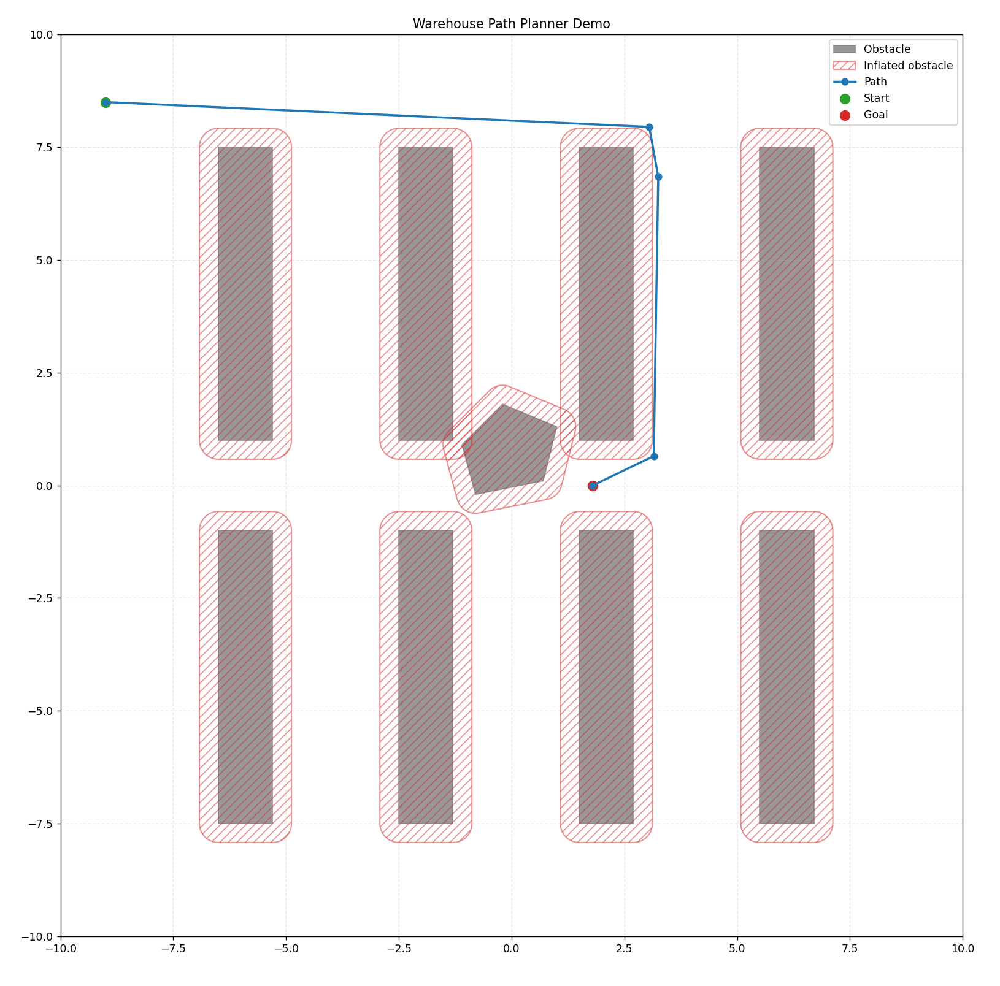
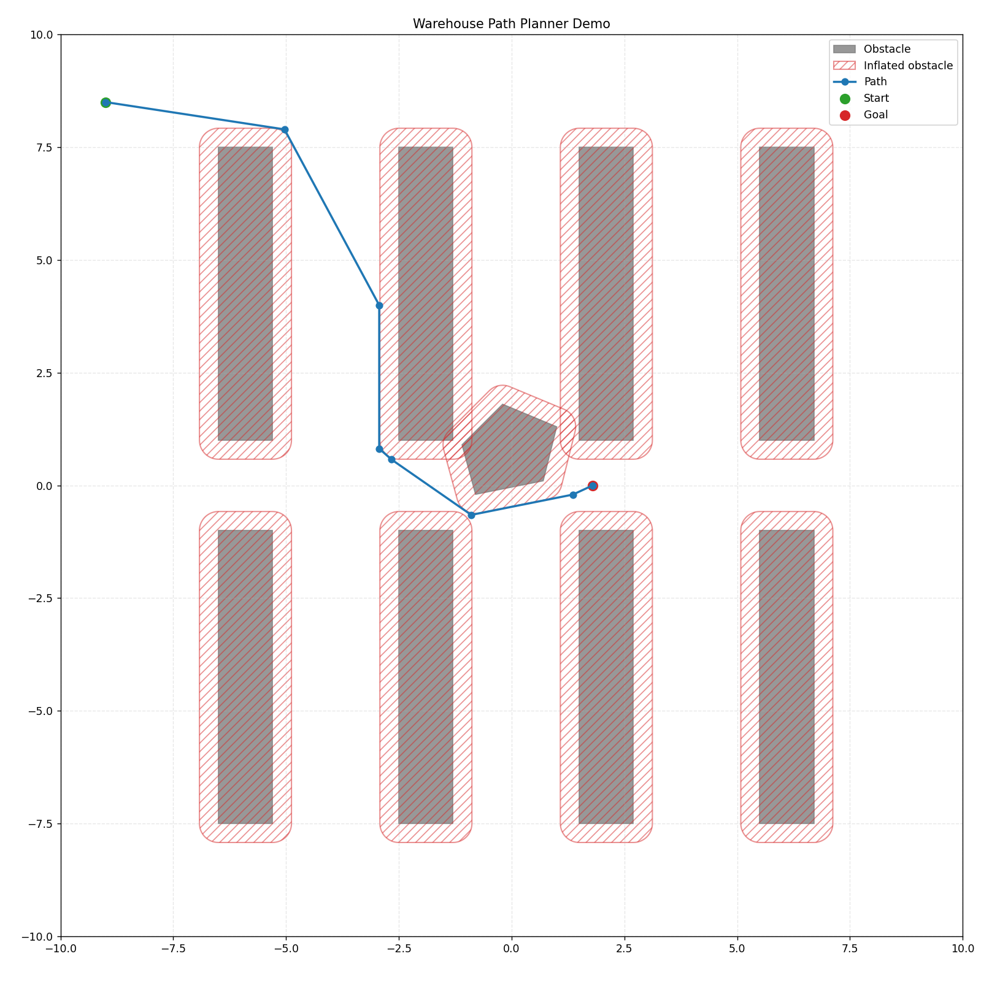

## Warehouse Path Planner

Mobile robots operating in warehouse environments must compute collision-free paths through cluttered spaces. These environments are commonly represented as **occupancy grids**, where free and occupied areas of the map are discretized.

This project implements a classical grid-based path planning pipeline:

Continuous Map → Occupancy Grid → Graph Construction → A* Search → Optimal Path

The planner takes a **continuous 2D map with polygonal obstacles**, converts it into an **occupancy grid**, and constructs a graph over the collision-free cells. The **A\*** algorithm is then used to compute the shortest path between a specified start and goal position.

Originally developed as part of a university robotics project involving a swarm of differential-drive robots, this repository packages the path planner as a **standalone module** that demonstrates how classical search algorithms can be integrated into a robotics navigation pipeline.

---

## What the Planner Does

The planner is split into two main parts:

### 1. `OccupancyGridPlanner`

`OccupancyGridPlanner` is responsible for turning a continuous map into a search problem.

It takes:
- map bounds
- static obstacles
- optional temporary obstacles
- robot geometry
- grid resolution
- safety margins

From this, it:

- discretizes the continuous workspace into an **occupancy grid**
- inflates obstacles based on the robot radius and safety margin
- marks grid cells as free or occupied
- builds a graph over the free cells
- connects neighboring cells
- maps the continuous start and goal positions to valid graph nodes
- calls the A* planner to compute the shortest collision-free path

In other words, this class handles the **environment representation** and the conversion from continuous geometry to a graph search problem.

### 2. `AStar`

`AStar` solves the graph search problem created by `OccupancyGridPlanner`.

Given:
- a graph
- a start node
- a goal node

it searches for a lowest-cost path through the graph using the A* algorithm.

This part is responsible for:
- expanding nodes in a goal-directed way
- tracking the current best-known cost to each node
- using a heuristic to guide the search efficiently
- reconstructing the final shortest path once the goal is reached

## Heuristic

The planner uses Euclidean distance as the heuristic function.

h(n) = √((x_goal - x_n)^2 + (y_goal - y_n)^2)

This heuristic is admissible for grid navigation and ensures optimal paths
while significantly reducing search effort compared to Dijkstra’s algorithm.

So while `OccupancyGridPlanner` builds the navigable graph, `AStar` is the component that actually finds the route through it.

---

### Installation

```bash
python3 -m venv .venv
source .venv/bin/activate
pip install -r requirements.txt
```

## Running the Demo

A simple demo is included to show the planner working on a small warehouse-style map.

```bash
PYTHONPATH=src python3 demo/demo_planner.py
```

The script visualizes the map, obstacles, and the computed path using **matplotlib**.

## Resolution Tradeoff

The planner represents the world as an **occupancy grid**, so the chosen grid resolution strongly affects both **path quality** and **runtime**.

- **Smaller resolution values (finer grid)**
  - more accurate obstacle representation
  - narrow passages may remain traversable
  - typically shorter or more direct paths
  - higher computational cost

- **Larger resolution values (coarser grid)**
  - faster planning
  - narrow gaps may disappear
  - paths can become longer or less direct

Using the same demo environment with two different resolutions produces different valid paths:

| Resolution | Path Length | Runtime |
|-----------|-------------|--------|
| `0.10` | `20.8797` | near-instant |
| `0.03` | `16.9215` | noticeably slower |

This is a standard tradeoff in grid-based planning: **better geometric fidelity usually costs more computation**.

### Coarser Grid (`resolution = 0.10`) vs. Finer Grid (`resolution = 0.03`)

<p align="center">
  
  
</p>

<p align="center">
  <em>Figure: Effect of grid resolution on the planned path. Left: coarser grid (0.10). Right: finer grid (0.03).</em>
</p>

---

## Notes

- Obstacles can be passed either as `Obstacle(shape=...)` instances or directly as shapely geometries.
- Temporary obstacles are supported via the `temporary_obstacles` argument and can be inflated separately to mimic other robots or dynamic obstacles.

---

## Original System Demo

This planner was originally used inside a larger **multi-robot warehouse project**.

The video below shows the broader system context in which this planner was used:

https://github.com/user-attachments/assets/7e8ee39e-a14b-46ac-9ff4-47c9e18d4fcd
